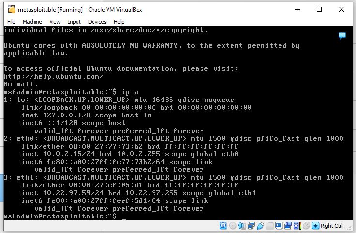
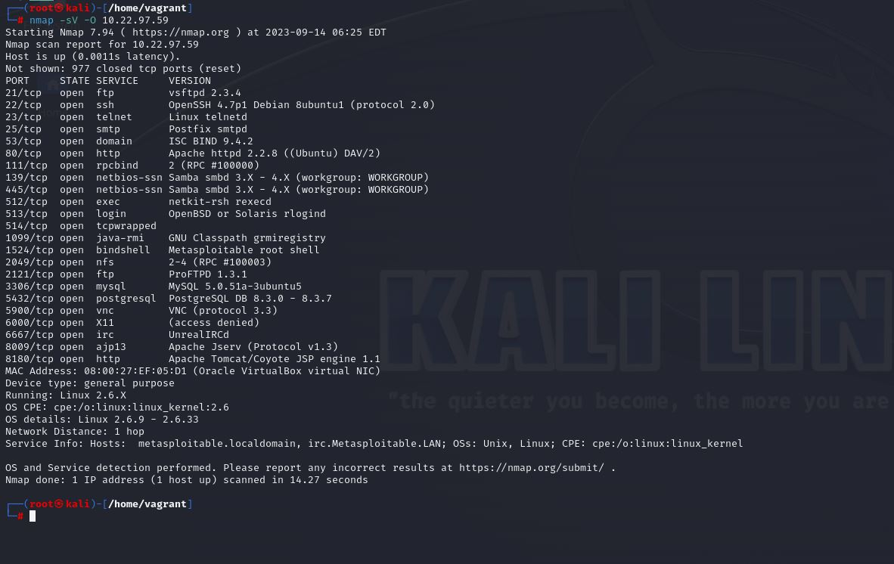
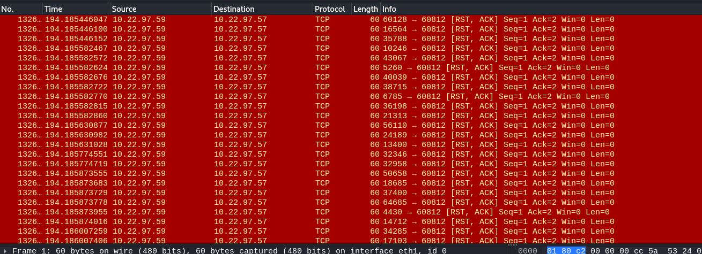
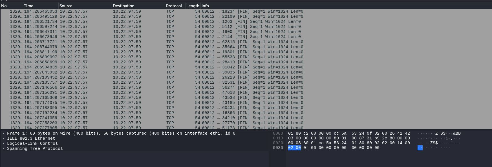

# Домашнее задание к занятию «Уязвимости и атаки на информационные системы», Лебедев А.И., FOPS-10

------

### Задание 1

Скачайте и установите виртуальную машину Metasploitable: https://sourceforge.net/projects/metasploitable/.

Это типовая ОС для экспериментов в области информационной безопасности, с которой следует начать при анализе уязвимостей.

Просканируйте эту виртуальную машину, используя **nmap**.

Попробуйте найти уязвимости, которым подвержена эта виртуальная машина.

Сами уязвимости можно поискать на сайте https://www.exploit-db.com/.

Для этого нужно в поиске ввести название сетевой службы, обнаруженной на атакуемой машине, и выбрать подходящие по версии уязвимости.

Ответьте на следующие вопросы:

- Какие сетевые службы в ней разрешены?
- Какие уязвимости были вами обнаружены? (список со ссылками: достаточно трёх уязвимостей)
  
*Приведите ответ в свободной форме.*    

### Решение:    

- Установим kali linux с графикой (т.к. в нем по дефолту есть нужные нам инструменты) используя vagrant:

```
config.vm.define "kali" do |kali|
    kali.vm.hostname = "kali"
    kali.vm.box = "kalilinux/rolling"
    kali.vm.network "public_network", bridge: "Intel(R) Ethernet Connection I219-LM"
    config.vm.provider "virtualbox" do |vb|
    vb.memory = "2048"
    vb.cpus = "2"
    vb.gui = "true"
  end
end
```

- Установим metasploitable linux для наших тестов по уязвимостям. Поднимем ему сетевой интерфейс в нашей подсети и проверим:

  

- Просканируем удаленную машину используя утилиту nmap с ключами -sV и -O, где -sV покажет версии служб и сервисов на открытых портах, а -O покажет версию ОС:

   

- Собственно, службы, разрешенные на удаленной машине:

FTP (vsftpd 2.3.4) на порту 21/tcp.  

SSH (OpenSSH 4.7p1 Debian 8ubuntu1) на порту 22/tcp.  

Telnet (Linux telnetd) на порту 23/tcp.  

SMTP (Postfix smtpd) на порту 25/tcp.  

DNS (ISC BIND 9.4.2) на порту 53/tcp.  

HTTP (Apache httpd 2.2.8) на порту 80/tcp.  

RPC (rpcbind 2) на порту 111/tcp.  

NetBIOS-SSN (Samba smbd 3.X - 4.X) на портах 139/tcp и 445/tcp.  

Remote Execution (netkit-rsh rexecd) на порту 512/tcp.  

Remote Login (OpenBSD or Solaris rlogind) на порту 513/tcp.  

TCPwrapped (tcpwrapped) на порту 514/tcp.  

Java RMI (GNU Classpath grmiregistry) на порту 1099/tcp.  

Bindshell (Metasploitable root shell) на порту 1524/tcp.  

NFS (Network File System) на порту 2049/tcp.  

FTP (ProFTPD 1.3.1) на порту 2121/tcp.  

MySQL (MySQL 5.0.51a-3ubuntu5) на порту 3306/tcp.  

PostgreSQL (PostgreSQL DB 8.3.0 - 8.3.7) на порту 5432/tcp.  

VNC (VNC protocol 3.3) на порту 5900/tcp.  

X11 (access denied) на порту 6000/tcp.  

IRC (UnrealIRCd) на порту 6667/tcp.  

AJP13 (Apache Jserv Protocol v1.3) на порту 8009/tcp.  

Apache Tomcat/Coyote JSP engine 1.1 (HTTP) на порту 8180/tcp.    

- Относительно уязвимостей. Вводим первое же название ftp-сервиса на 21м порту и получаем несколько версий эксплойтов (один для metasploit):

<a href> https://www.exploit-db.com/exploits/49757 </a>  

<a href> https://www.exploit-db.com/exploits/17491 </a>  

- Далее, мое внимание привлек открытый порт IRC-демона. К сожалению, версию он не показывает, но есть, как и эксплойты, так и Denial of Service уязвимости в базе:

<a href> https://www.exploit-db.com/exploits/27407  </a>  

<a href> https://www.exploit-db.com/exploits/16922 </a>  

- Также, нашелся эксплоит и для днс-сервера BIND нужной нам версии:

<a href> https://www.exploit-db.com/exploits/6122 </a>  

 - Могу отметить, также, момент, что, при выполнении скрипта с данным ключом: **nmap -sV --script vulners 10.22.97.59**, мы получаем большую простыню с уязвимостями и пояснениями (и со ссылками) на сайт vulners.com 


---

### Задание 2

Проведите сканирование Metasploitable в режимах SYN, FIN, Xmas, UDP.

Запишите сеансы сканирования в Wireshark.

Ответьте на следующие вопросы:

- Чем отличаются эти режимы сканирования с точки зрения сетевого трафика?
- Как отвечает сервер?

*Приведите ответ в свободной форме.*  

### Решение:  

- начнем с режима SYN и воспользуемся следующей командой - **nmap -sS -p 1-65535 -T4 -A 10.22.97.59**, где выберем диапазон портов, установим скорость сканирования 4 и включим агрессивное обнаружение версий сервисов. Также, запустим вайршарк слушать наш сетевой интерфейс. Посмотрим, что происходит:

   

В этом режиме сканирования отправляются пакеты с установленным флагом SYN на целевой порт. Ожидается ответ с флагами SYN и ACK, если порт открыт, или только с флагом RST, если порт закрыт.  

- FIN-сканирование: **nmap -sF -p 1-65535 -T4 -A 10.22.97.59**:

  

В этом режиме отправляются пакеты с установленным флагом FIN на целевой порт. Ожидается ответ с флагом RST, если порт закрыт, или отсутствие ответа, если порт открыт.  

- Xmas-сканирование: **nmap -sX -p 1-65535 -T4 -A 10.22.97.59**

  

Этот метод аналогичен FIN сканированию, но отправляются пакеты с установленными флагами FIN, PSH и URG. Ожидается ответ с флагом RST, если порт закрыт, или отсутствие ответа, если порт открыт.  

- Сканирование по UDP-портам: **nmap -sU -p 1-65535 -T4 -A 10.22.97.59**

  

Здесь все очень просто. Если udp-порт открыт - есть ответ. Если закрыт - ответа нет.
